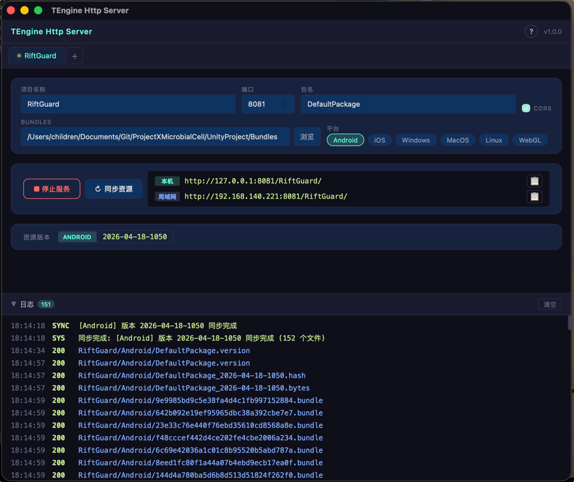
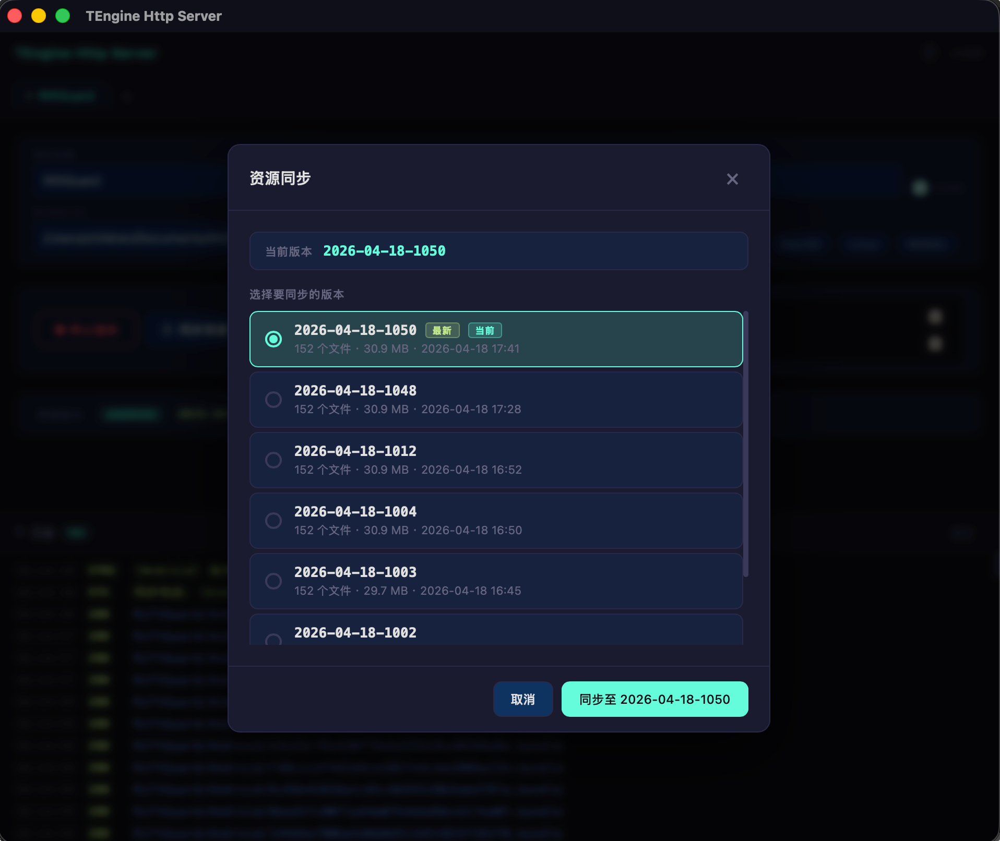
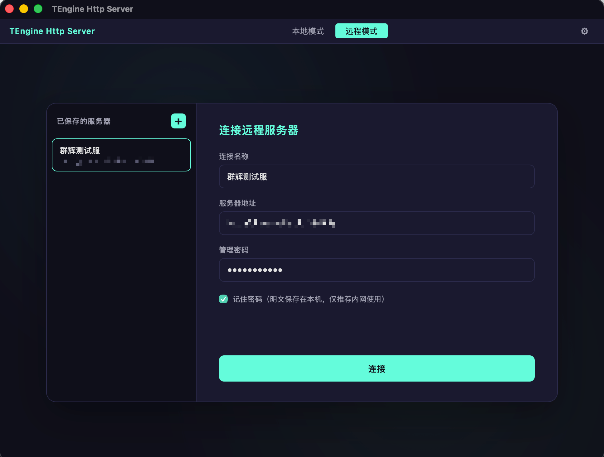
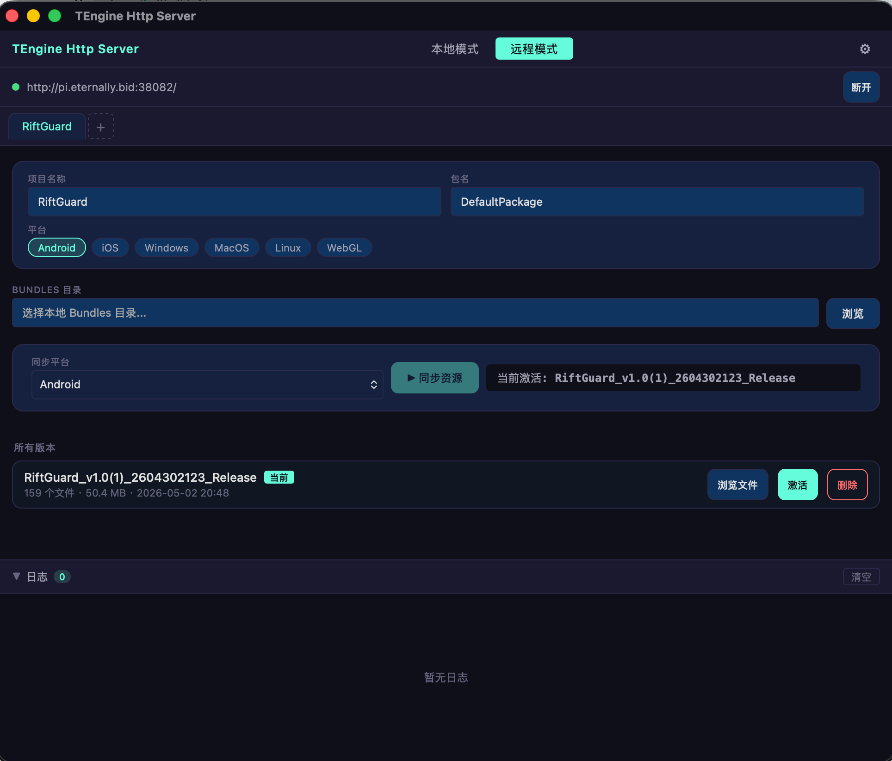

# TEngine Http Server

为 Unity [TEngine](https://github.com/ALEXTANGXIAO/TEngine) 框架的 [YooAsset](https://github.com/tuyoogame/YooAsset) 热更新资源提供 **本地服务** 与 **远程分发服务** 的桌面工具。

由 [Tauri 2](https://tauri.app/) + [Vue 3](https://vuejs.org/) + [Axum](https://github.com/tokio-rs/axum) 构建，支持两种使用模式：

- **🏠 本地模式** — 在自己电脑上启动 HTTP 服务，给本机或局域网设备提供资源
- **☁️ 远程模式** — 连接到部署在云服务器或 NAS 的 Docker 实例，把资源上传到远端给所有人下载

替代传统的 `start.bat` + Nginx/Python 方案，提供可视化操作界面，一键启动、一键同步、一键上传。






---

## 功能特性

### 本地模式

- 基于 Axum 的高性能 HTTP 服务，自动 MIME 识别，路径安全校验
- 自动扫描 YooAsset 构建产物，可选择历史版本同步
- 多项目并行（不同端口）
- 6 大平台支持（Android / iOS / Windows / macOS / Linux / WebGL）
- 可选 CORS（WebGL 必备）
- 自动检测局域网 IP，方便手机连同 WiFi 测试
- 实时 HTTP 请求日志面板

### 远程模式（v1.0.1 新增）

- 一套独立的 Axum 后端，Docker 一键部署到任何支持 Docker 的服务器
- 自带 Web 管理界面（无需装客户端，浏览器即可管理）
- **多服务器记录** — Tauri 客户端侧栏保存多个服务器，一键切换
- **从本地 Bundles 同步到远端** — 选目录 + 选版本 + 一键上传，自动激活
- **版本管理** — 服务器端保留所有上传过的版本，可随时切换激活版本
- **文件浏览** — 浏览每个版本的具体文件，激活版本可复制 URL 或在浏览器查看内容
- **WebSocket 实时日志** — 远程服务器的所有请求实时推送到客户端
- **认证方案** — 客户端 SHA-256 + 服务器 Argon2 + JWT，密码不明文传输
- **路径遍历防护** — 上传 / 访问 / 删除等操作都校验路径合法性

### 通用

- 配置自动持久化，下次启动恢复上次状态
- 设置中心：版本信息、清理缓存、内置使用指南
- 跨平台桌面应用（Windows / macOS / Linux）
- 帮助内置三标签 Tab：项目简介 / 本地模式 / 远程模式

---

## 技术栈

| 层级 | 技术 |
|------|------|
| 桌面客户端前端 | Vue 3 + TypeScript + Vite |
| 桌面客户端后端 | Rust + Tauri 2 |
| 远程服务后端 | Rust + Axum 0.7 + Tokio |
| Web 管理界面 | Vue 3 + Vite（通过 `rust-embed` 嵌入服务器二进制） |
| 认证 | Argon2（密码哈希）+ JWT（会话）+ SHA-256（传输） |
| 部署 | Docker 多阶段构建（node → rust → debian-slim） |

---

## 快速开始

### 环境要求

- [Node.js](https://nodejs.org/) >= 18
- [Rust](https://rustup.rs/) >= 1.85（远程服务部分需要 1.88+，Docker 已固定 1.90）
- 系统依赖：
  - **Windows**：Visual Studio Build Tools（C++ 桌面开发工作负载）
  - **macOS**：Xcode Command Line Tools（`xcode-select --install`）
- **远程模式部署**：[Docker](https://www.docker.com/)（NAS 或服务器侧）

### 开发运行（桌面客户端）

```bash
npm install
npm run tauri dev
```

### 构建打包（桌面客户端）

```bash
npm run tauri build
```

产物位于 `src-tauri/target/release/bundle/`。

> Tauri 不支持交叉编译。Windows `.exe` 需在 Windows 上构建，macOS `.app` 需在 macOS 上构建。

### 远程服务部署（Docker）

服务器需先装好 Docker。两种部署方式选一种：

**A. 源码部署**（服务器能访问外网）

```bash
git clone <你的仓库>
cd TEngineHttp/server
cp .env.example .env && vim .env       # 设置 ADMIN_PASSWORD
docker compose up -d --build
```

**B. 离线部署**（服务器无法访问外网）

```bash
# 开发机构建导出（注意架构：amd64 或 arm64，不匹配会报 exec format error）
docker buildx build --platform linux/amd64 -f server/Dockerfile -t server-tengine-server:latest --load .
docker save server-tengine-server:latest | gzip > server/tengine-server.tar.gz

# 把 server/tengine-server.tar.gz、docker-compose.offline.yml、.env.example 传到服务器后
gunzip -c tengine-server.tar.gz | docker load
cp .env.example .env && vim .env
docker compose -f docker-compose.offline.yml up -d
```

部署完访问 `http://<服务器IP>:8082`。

> **更新镜像必须删容器重建**（`restart` 不会换镜像）：`docker compose down && docker compose up -d --build`

### 环境变量

| 变量 | 必填 | 默认值 | 说明 |
|------|------|--------|------|
| `ADMIN_PASSWORD` | ✅ | — | 管理密码（明文，服务端会做 Argon2 哈希） |
| `JWT_SECRET` | ❌ | 随机生成 | JWT 签名密钥（重启后生成会让所有 token 失效） |
| `PORT` | ❌ | `8082` | 监听端口 |
| `DATA_DIR` | ❌ | `/data` | 数据目录 |
| `TOKEN_EXPIRE_HOURS` | ❌ | `24` | JWT 过期时间（小时） |

---

## 使用流程

### 本地模式（6 步）

1. **Unity 构建资源** — YooAsset AssetBundle Builder 构建到 Bundles 目录
2. **配置项目** — 软件中填项目名、包名（默认 DefaultPackage）、平台、端口
3. **选择 Bundles 目录** — 点「浏览」选第 1 步输出目录
4. **同步资源** — 点「↻ 同步资源」，选要测试的版本
5. **启动服务** — 点「▶ 启动服务」，复制显示的 URL
6. **Unity 接入** — `HostPlayMode` 的 `IRemoteServices` 指向该 URL

### 远程模式（7 步）

1. **服务器端部署 Docker 镜像**（见上方部署说明）
2. **Unity 构建资源**（同本地模式）
3. **切到远程模式** — 顶部点「远程模式」按钮
4. **登录服务器** — 填连接名称、服务器地址、管理密码（可勾选记住密码）
5. **新建项目并选 Bundles 目录** — 跟本地模式一样填项目配置
6. **同步资源** — 点「▶ 同步资源」选版本，自动 multipart 上传到服务器并激活
7. **Unity 接入** — URL 改成 `http://<服务器>:<端口>/res/<项目名>/<平台>/`

---

## API 接口

远程服务暴露如下 REST + WebSocket 接口。

### 公开接口

| 方法 | 路径 | 说明 |
|------|------|------|
| GET | `/` | Web 管理界面（嵌入式 SPA） |
| GET | `/res/<project>/<platform>/<file>` | 资源文件下载（无需认证） |
| GET | `/api/health` | 健康检查 |
| POST | `/api/auth/login` | 登录获取 JWT |

### 管理接口（JWT 保护）

| 方法 | 路径 | 说明 |
|------|------|------|
| GET / POST | `/api/projects` | 项目列表 / 创建 |
| PUT / DELETE | `/api/projects/:id` | 更新 / 删除项目 |
| POST | `/api/projects/:id/upload` | 上传资源（multipart，512MB 上限） |
| GET | `/api/projects/:id/versions?platform=X` | 列出版本 |
| PUT | `/api/projects/:id/versions/:ver/activate` | 激活版本 |
| DELETE | `/api/projects/:id/versions/:ver` | 删除版本 |
| GET | `/api/projects/:id/files?platform=X[&version=Y]` | 列出文件（不传 version 列激活版本） |
| WebSocket | `/api/ws/logs?token=<jwt>` | 实时日志推送 |

---

## 项目结构

```
TEngineHttp/
├── src/                          # Tauri 客户端前端 (Vue 3)
│   ├── App.vue                   # 标题栏 + 模式切换 + 设置
│   ├── components/
│   │   ├── LocalMode.vue         # 本地模式
│   │   ├── RemoteMode.vue        # 远程模式（多服务器、文件浏览、版本管理）
│   │   ├── HelpModal.vue         # 帮助弹窗（3 标签 Tab）
│   │   └── SettingsDialog.vue    # 设置弹窗
│   ├── api/
│   │   └── remote.ts             # 远程 API 客户端
│   └── styles/
├── src-tauri/                    # Tauri 客户端后端 (Rust)
│   └── src/
│       ├── lib.rs                # 命令注册 + 远程上传命令（reqwest multipart）
│       ├── server.rs             # 本地 HTTP 服务
│       ├── sync.rs               # 本地版本同步（符号链接 / 文件复制）
│       └── config.rs             # 配置持久化
├── server/                       # 远程服务（独立 Axum 后端）
│   ├── Cargo.toml
│   ├── Dockerfile                # 多阶段构建 (node → rust → debian-slim)
│   ├── docker-compose.yml        # 源码部署
│   ├── docker-compose.offline.yml # 离线镜像部署
│   ├── .env.example
│   └── src/
│       ├── main.rs               # 入口
│       ├── config.rs             # 服务端配置（环境变量、project 持久化）
│       ├── auth.rs               # Argon2 + JWT 认证
│       ├── storage.rs            # 资源存储（路径校验、版本管理、文件列表）
│       ├── api.rs                # REST 路由
│       ├── ws.rs                 # WebSocket 日志广播
│       └── serve.rs              # 静态资源 + SPA 嵌入服务
├── web-admin/                    # Web 管理界面（嵌入服务端二进制）
│   ├── package.json
│   ├── vite.config.ts
│   └── src/
│       ├── App.vue
│       ├── api/remote.ts         # 与 Tauri 客户端共用同款 API client
│       └── components/
│           ├── RemoteLogin.vue
│           ├── ProjectManager.vue
│           ├── HelpModal.vue
│           ├── SettingsDialog.vue
│           └── LogPanel.vue
├── package.json                  # Tauri 客户端依赖
└── README.md
```

---

## 安全说明

- 管理密码客户端做 SHA-256 后传输，服务端用 Argon2 比对，**不传输明文**
- JWT 默认 24 小时过期
- 资源下载路径 (`/res/*`) **公开访问**（YooAsset 客户端无认证机制限制）
  - 担心带宽被滥用？建议配合 Cloudflare 防盗链 / 速率限制
- 上传 / 项目更新 / 版本操作都有路径遍历防护
- 上传单次大小限制 512MB（可在 `server/src/api.rs` 调整）

> **生产环境强烈建议**配合 HTTPS（Nginx / Caddy 反代 + Let's Encrypt 证书）

---

## License

MIT
