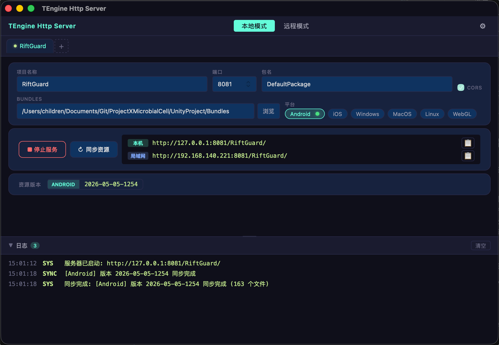
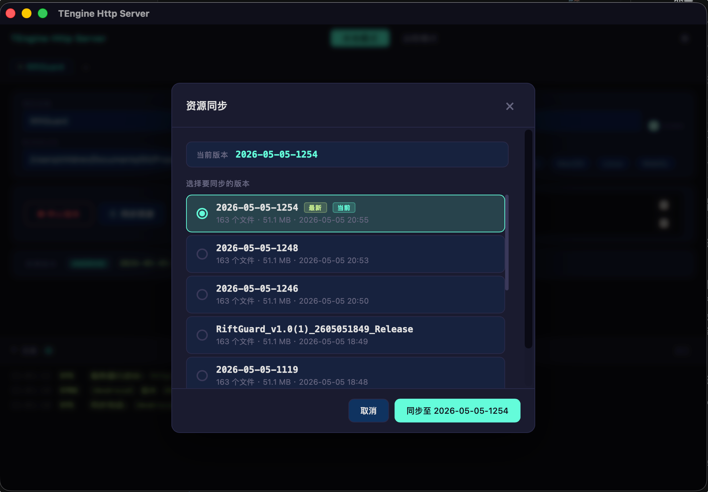
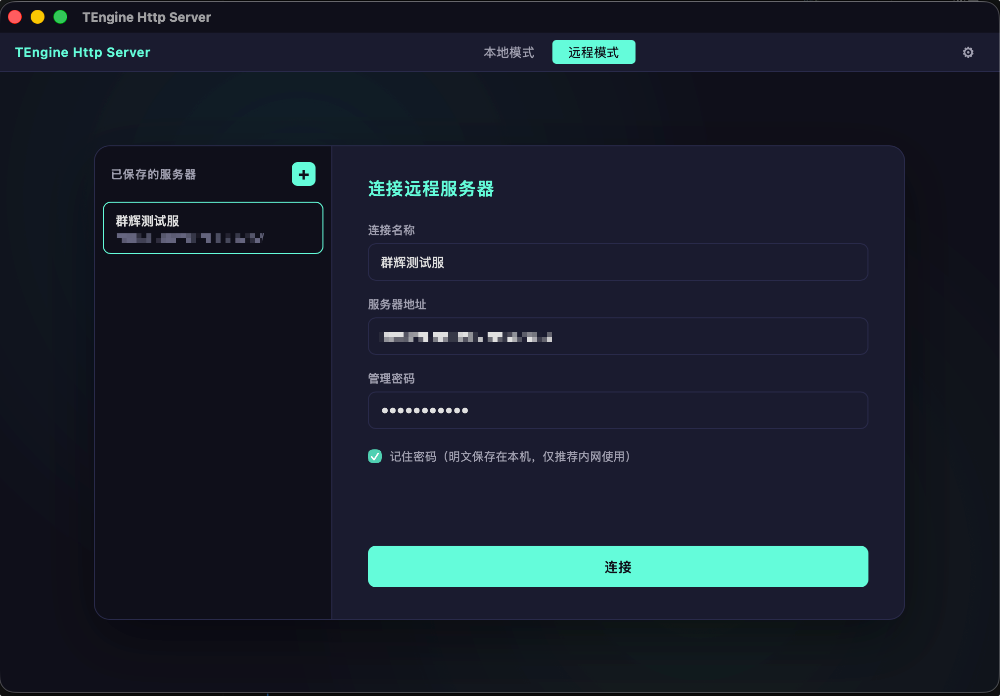
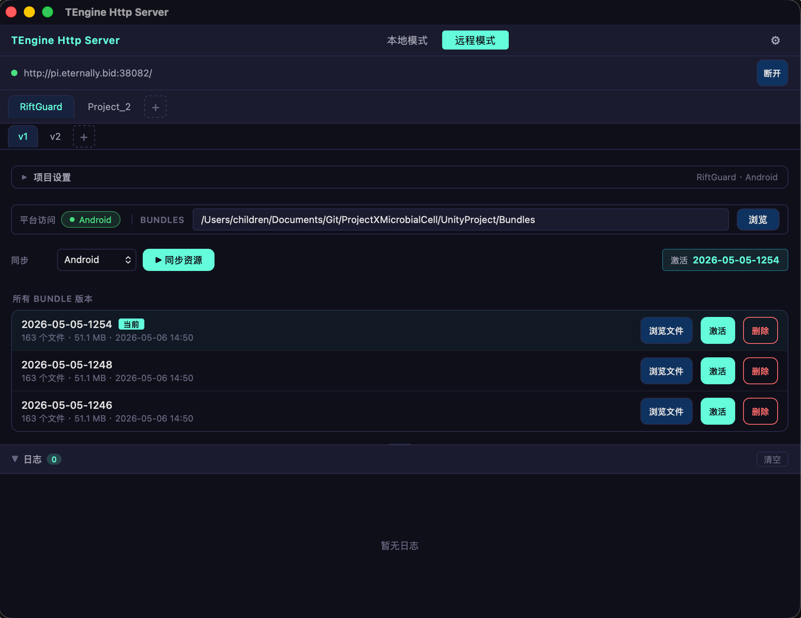

# TEngine Http Server

为 Unity [TEngine](https://github.com/ALEXTANGXIAO/TEngine) + [YooAsset](https://github.com/tuyoogame/YooAsset) 提供热更新资源分发的桌面工具。

由 [Tauri 2](https://tauri.app/) + [Vue 3](https://vuejs.org/) + [Axum](https://github.com/tokio-rs/axum) 构建。

- **🏠 本地模式** — 在本机起 HTTP 服务，给本机或局域网设备提供资源
- **☁️ 远程模式** — 连接部署在云 / NAS 的 Docker 实例，把资源上传到远端

替代传统 `start.bat` + Nginx 的方案，可视化操作，一键启动 / 同步 / 上传。






---

## 功能特性

### 通用

- 多项目并行管理，每个项目独立配置端口 / 平台 / 包名
- 6 平台（Android / iOS / Windows / macOS / Linux / WebGL）
- 自动扫描 YooAsset 构建产物，可选择历史版本同步
- 实时请求日志面板（带项目 / 版本 scope 标记）
- 配置自动持久化，跨平台桌面端（Windows / macOS / Linux）

### 本地模式

- 基于 Axum 的高性能静态文件服务，自动 MIME / 路径遍历防护
- 自动检测局域网 IP，方便手机连同 WiFi 测试
- 可选 CORS（WebGL 必备）
- **平台访问开关** — 每个平台独立开关，无需重启即可禁用某平台路径

### 远程模式

- 独立 Axum 后端，Docker 一键部署到任何 Linux 服务器
- 自带 Web 管理界面（无需客户端，浏览器即可管理）
- **多服务器记录** — 客户端侧栏保存连接，一键切换
- **两层版本模型** — 项目版本（v1/v2/...）独立管理 bundle，URL 格式 `/res/{项目版本}/{项目}/{平台}/{文件}`，适合 SDK 灰度 / 多渠道并存
- **平台访问开关** — 每个（项目版本 × 平台）独立，关闭后该路径资源立即返回 403
- **激活仅元数据** — 不再复制文件，激活只切换"当前 bundle"标记，省一倍磁盘
- **增量上传** — 客户端比对 MD5，只传修改 + 新增文件，未变更文件由服务端从基础版本复用
- **版本 / 项目版本重命名** — 双击标签或在项目设置内联编辑，磁盘目录同步重命名
- **删除二次确认** — 项目 / 项目版本 / Bundle 三级删除均走原生确认弹窗
- **文件浏览** — 浏览每个版本的具体文件，激活版本可复制 URL 或直接预览内容
- **WebSocket 日志推送** — 远端所有请求实时推到客户端，走 Tauri 原生 ws 避免 webview CORS
- **认证 / 安全** — 客户端 SHA-256 + 服务端 Argon2 + JWT；上传 / 删除等操作严格路径校验

---

## 技术栈

| 层级 | 技术 |
|------|------|
| 桌面客户端 | Vue 3 + TypeScript + Tauri 2 |
| 远程服务后端 | Rust + Axum 0.7 + Tokio |
| Web 管理界面 | Vue 3（通过 `rust-embed` 嵌入服务器二进制） |
| 认证 | Argon2 + JWT + SHA-256 |
| 部署 | Docker 多阶段构建（node → rust → debian-slim） |

---

## 快速开始

### 环境要求

- [Node.js](https://nodejs.org/) >= 18
- [Rust](https://rustup.rs/) >= 1.85（远程服务部分需要 1.88+，Docker 已固定 1.90）
- **Windows**：Visual Studio Build Tools（C++ 桌面开发工作负载）
- **macOS**：Xcode Command Line Tools
- 远程模式部署：[Docker](https://www.docker.com/)

### 桌面客户端

```bash
npm install
npm run tauri dev          # 开发
npm run tauri build        # 打包，产物在 src-tauri/target/release/bundle/
```

> Tauri 不支持交叉编译。`.exe` 必须在 Windows 上构建，`.app` 必须在 macOS 上构建。

### 远程服务（Docker）

```bash
# 源码部署（服务器能访问外网）
cd server
cp .env.example .env && vim .env       # 设 ADMIN_PASSWORD / JWT_SECRET
docker compose up -d --build

# 离线部署（开发机构建后上传）
docker buildx build --platform linux/amd64 -f server/Dockerfile -t tengine-server:latest --load .
docker save tengine-server:latest | gzip > tengine-server.tar.gz
# 上传 tar 到服务器:
docker load < tengine-server.tar.gz
docker compose -f docker-compose.offline.yml up -d
```

部署后访问 `http://<服务器IP>:8082`。更新镜像必须 `docker compose down && docker compose up -d --build`，restart 不会换镜像。

### 环境变量

| 变量 | 必填 | 默认 | 说明 |
|------|------|------|------|
| `ADMIN_PASSWORD` | ✅ | — | 管理密码（明文，服务端 Argon2 哈希） |
| `JWT_SECRET` | ❌ | 随机 | JWT 签名密钥，**生产环境务必固定**否则重启后 token 全失效 |
| `PORT` | ❌ | `8082` | 监听端口 |
| `DATA_DIR` | ❌ | `/data` | 数据目录 |
| `TOKEN_EXPIRE_HOURS` | ❌ | `24` | JWT 过期时间 |

### 升级版本

```bash
npm version 0.0.4    # 自动同步到 4 个文件 + 提交 + 打 tag
```

---

## 使用流程

### 本地模式

1. **Unity 构建** — YooAsset Builder 输出到 Bundles 目录
2. **配置** — 填项目名、包名、平台、端口
3. **选目录 + 同步** — 点「浏览」选 Bundles，点「↻ 同步资源」选版本
4. **启动 + 接入** — 点「▶ 启动服务」，复制 URL 填到 Unity 的 `IRemoteServices`

### 远程模式

1. **服务器部署 Docker**（见上方）
2. **客户端登录** — 填地址 + 密码连接
3. **建项目 / 项目版本** — 一级标签建项目（RiftGuard...），二级标签建项目版本（v1 / v2 ...）
4. **同步上传** — 选 Bundles 目录 + 平台 + 版本，点「同步资源」自动上传到当前选中的项目版本并激活
5. **接入** — Unity 用 `http://<服务器>:<端口>/res/{项目版本}/{项目名}/{平台}/`，例：`http://10.0.0.1:8082/res/v1/RiftGuard/Android/`

---

## API 接口

资源 URL：`/res/{project_version}/{project_name}/{platform}/{file}` — 无需认证。

### 公开

| 方法 | 路径 | 说明 |
|------|------|------|
| GET | `/` | Web 管理界面（嵌入式 SPA） |
| GET | `/res/...` | 资源下载 |
| GET | `/api/health` | 健康检查 |
| POST | `/api/auth/login` | 登录获取 JWT |

### 管理（JWT 保护）

| 方法 | 路径 | 说明 |
|------|------|------|
| GET / POST | `/api/projects` | 项目列表 / 创建 |
| PUT / DELETE | `/api/projects/:id` | 更新 / 删除项目 |
| GET / POST | `/api/projects/:id/project-versions` | 项目版本列表 / 创建 |
| PUT / DELETE | `/api/projects/:id/project-versions/:pver` | 重命名 / 删除项目版本 |
| PUT | `.../project-versions/:pver/platforms/:plat/access` | 切换平台访问开关 |
| POST | `.../project-versions/:pver/upload` | 全量上传（multipart, 512MB 上限） |
| POST | `.../project-versions/:pver/incremental-upload` | 增量上传 |
| GET | `.../project-versions/:pver/manifest?platform=X&version=Y` | 文件清单（含 MD5） |
| GET | `.../project-versions/:pver/versions?platform=X` | 列出 bundle 版本 |
| PUT | `.../project-versions/:pver/versions/:ver/activate?platform=X` | 激活版本 |
| DELETE | `.../project-versions/:pver/versions/:ver?platform=X` | 删除版本 |
| GET | `.../project-versions/:pver/files?platform=X&version=Y` | 列出文件 |
| WebSocket | `/api/ws/logs?token=<jwt>` | 实时日志推送 |

---

## 项目结构

```
TEngineHttp/
├── src/                  # Tauri 客户端前端（Vue 3）
│   ├── components/       # LocalMode / RemoteMode / Help / Settings
│   ├── api/remote.ts     # 远程 API 客户端
│   └── App.vue
├── src-tauri/            # Tauri 客户端后端（Rust）
│   └── src/
│       ├── lib.rs        # 命令注册 + reqwest 上传
│       ├── server.rs     # 本地 HTTP 服务
│       ├── sync.rs       # 本地版本同步
│       └── config.rs
├── server/               # 远程服务（独立 Axum 后端）
│   ├── src/
│   │   ├── main.rs / config.rs / auth.rs
│   │   ├── api.rs        # REST 路由
│   │   ├── storage.rs    # 资源存储（项目版本 / 平台 / bundle 三级）
│   │   ├── ws.rs         # WebSocket 日志广播
│   │   └── serve.rs      # 资源 / SPA 服务
│   ├── Dockerfile / docker-compose*.yml / .env.example
├── web-admin/            # Web 管理界面（嵌入服务端二进制）
├── scripts/sync-version.mjs   # 版本号同步脚本
└── docs/superpowers/specs|plans/   # 功能设计 / 实施计划文档
```

---

## 安全说明

- 管理密码客户端 SHA-256，服务端 Argon2 比对，不传输明文
- JWT 默认 24 小时过期，密钥由 `JWT_SECRET` 控制
- 资源下载（`/res/*`）**公开**，平台访问开关可临时下线某条路径
- 担心带宽被滥用，建议配合 Cloudflare 防盗链 / 速率限制
- 上传 / 删除 / 重命名等操作严格做路径遍历防护
- 上传单次大小限制 512MB（`server/src/api.rs` 可调）
- **生产环境强烈建议** HTTPS：Nginx / Caddy 反代 + Let's Encrypt

---

## License

MIT
